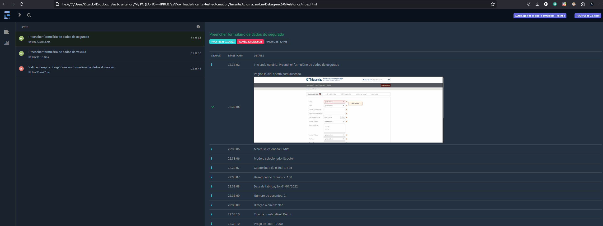

# Projeto de Automação de Testes - Tricentis Sample App

Este projeto implementa testes automatizados para o site [Tricentis Sample App](http://sampleapp.tricentis.com/101/app.php) utilizando Selenium WebDriver com C#, seguindo o padrão Page Objects e implementando testes BDD com Cucumber/Gherkin.

## 📋 Índice

- [Tecnologias Utilizadas](#tecnologias-utilizadas)
- [Estrutura do Projeto](#estrutura-do-projeto)
- [Pré-requisitos](#pré-requisitos)
- [Configuração](#configuração)
- [Execução dos Testes](#execução-dos-testes)
- [Relatórios e Evidências](#relatórios-e-evidências)
- [Solução de Problemas](#solução-de-problemas)
- [Funcionalidades Implementadas](#funcionalidades-implementadas)

## 🛠️ Tecnologias Utilizadas

- **C#** - Linguagem de programação
- **Selenium WebDriver** - Framework de automação de testes
- **SpecFlow** - Framework BDD para .NET (Cucumber para C#)
- **NUnit** - Framework de testes
- **ExtentReports** - Geração de relatórios HTML
- **Visual Studio 2022** - IDE de desenvolvimento

## 📁 Estrutura do Projeto

```
TricentisAutomacao/
├── drivers/                  # Contém o ChromeDriver
├── Evidencias/               # Pasta onde são salvas as capturas de tela
├── Features/                 # Arquivos .feature com cenários BDD em Gherkin
├── Hooks/                    # Configurações de inicialização e finalização dos testes
├── Pages/                    # Classes Page Objects
├── Relatorios/               # Pasta onde são salvos os relatórios HTML
├── Steps/                    # Implementação dos passos definidos nos arquivos .feature
└── Utils/                    # Classes utilitárias
    ├── ConfiguracaoDriver.cs # Configuração do WebDriver
    ├── GeradorRelatorio.cs   # Geração de relatórios e evidências
    └── WebDriverManager.cs   # Gerenciamento do driver do navegador
```

## 📋 Pré-requisitos

- Visual Studio 2022
- .NET 6.0 ou superior
- Google Chrome instalado
- ChromeDriver compatível com a versão do Chrome (incluído na pasta `drivers`)


## 📋 Pré-requisitos

- Visual Studio 2022
- .NET 6.0 ou superior
- Google Chrome instalado
- ChromeDriver compatível com a versão do Chrome (incluído na pasta `drivers`)

## ⚙️ Configuração

1. Clone o repositório

## 🧾 Relatórios e Evidências

Após a execução dos testes, o **relatório HTML** e as **evidências (capturas de tela)** são gerados automaticamente e salvos no seguinte caminho:

## TricentisAutomacao/bin/Debug/net6.0/


- O arquivo de **relatório** geralmente estará com o nome `RelatorioTestes.html` (ou semelhante).
- As **evidências** são imagens que mostram o resultado da execução de cada cenário.

Abaixo, um exemplo animado da execução dos testes:



> 📌 A pasta `bin/Debug/net6.0` é criada automaticamente durante a execução do projeto no Visual Studio.